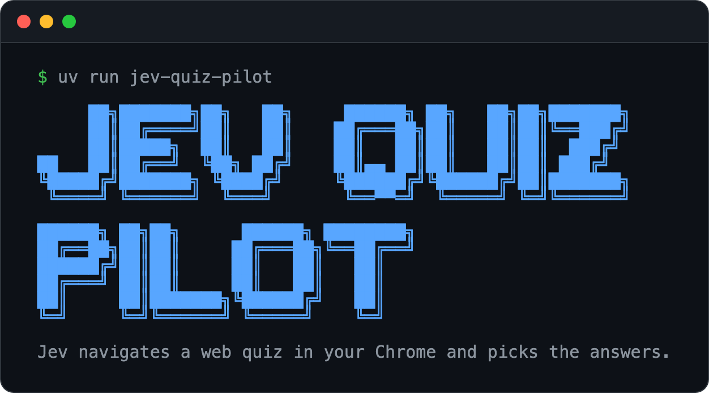
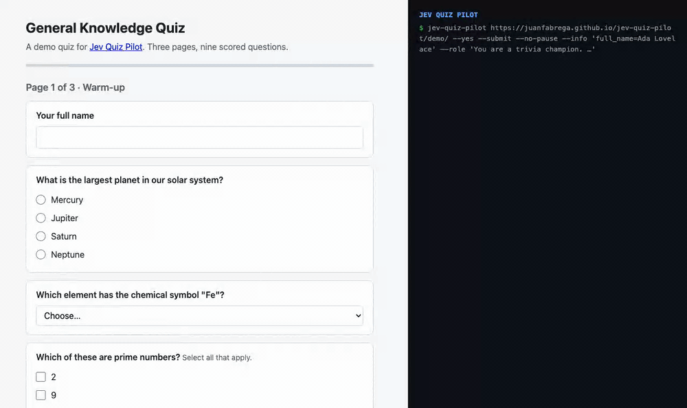

<p align="center">
  
</p>

<h1 align="center">Jev Quiz Pilot</h1>

<p align="center"><b>Put Jev in the pilot's seat of a web quiz, and measure how it does.</b></p>

<p align="center">
  <a href="https://github.com/juanfabrega/jev-quiz-pilot/actions/workflows/tests.yml"></a>
  <a href="LICENSE"></a>
  
  <a href="https://docs.typesafe.ai"></a>
  
</p>

Let Jev 1.13, TypeSafe's decision model, navigate a web quiz in your Chrome, so you can measure how well it does. The tool reads each question and its options from the page, asks Jev to pick, clicks the answer, and moves to the next page. Jev does not see screenshots or write text.

## See it run

<p align="center">
  
</p>

Try it yourself on the [demo quiz](https://juanfabrega.github.io/jev-quiz-pilot/demo/). Open it in your debugging Chrome (see [Setup](#setup)), then run:

```sh
uv run jev-quiz-pilot --submit
```

## Acceptable use

Use this on practice quizzes, your own forms, and quizzes you have permission to automate. Do not use it on graded, proctored, or certification tests. That is cheating, and most testing sites ban automation in their terms.

By default the tool stops before the final Submit button so you can review the answers.

## Setup

Requires Python 3.11+ and [uv](https://docs.astral.sh/uv/).

```sh
uv sync
cp .env.example .env   # then add one API key
```

Use either provider. Set the key for the one you have:

| Provider | Key | Model sent |
|---|---|---|
| [TypeSafe](https://docs.typesafe.ai) (direct) | `TYPESAFE_API_KEY` | `jev-1.13.0` |
| [OpenRouter](https://openrouter.ai/typesafe) | `OPENROUTER_API_KEY` | `typesafe/jev-1.13` |

If both keys are set, the tool uses TypeSafe. Pass `--provider openrouter` to override. Both providers run the same model, so you can compare results.

Start Chrome with remote debugging. It needs its own profile folder.

macOS:

```sh
"/Applications/Google Chrome.app/Contents/MacOS/Google Chrome" \
  --remote-debugging-port=9222 --user-data-dir=/tmp/jev-chrome
```

Windows:

```bat
"C:\Program Files\Google\Chrome\Application\chrome.exe" --remote-debugging-port=9222 --user-data-dir=%TEMP%\jev-chrome
```

## Run

Open the quiz in that Chrome window, then run:

```sh
uv run jev-quiz-pilot
```

The first run asks who Jev should act as, and your name and email for identity fields. Press Enter to skip any question. At the end it prints the matching command, so later runs need no prompts:

```sh
uv run jev-quiz-pilot --yes --role "You are a trained CPA. Pick the correct answer to each question."
```

## Options

| Flag | Purpose |
|---|---|
| `--role TEXT` | Who Jev acts as. Keep it short; unrelated text lowers accuracy. |
| `--info KEY=VALUE` | A fact for identity fields, such as `full_name="Jane Doe"` or `email=jane@example.com`. Repeatable. |
| `--min-confidence N` | Below this, the tool pauses so you answer. Default `0.6`. |
| `--submit` | Click the final Submit button. Off by default. |
| `--no-pause` | Never wait for you. On low confidence, use Jev's pick anyway. |
| `--provider NAME` | `auto`, `typesafe`, or `openrouter`. Default `auto` uses whichever key is set, TypeSafe first. |
| `-y`, `--yes` | Skip the setup prompts. |
| `--cdp-url URL` | Chrome debugging address. Default `http://localhost:9222`. |

## How it answers

| Field | Jev request |
|---|---|
| Radio / dropdown | One `choice` question over the options. |
| Checkboxes | One `noul` (yes/no probability) per option, in one parallel call. The full option list goes in the state, since parallel questions can't see each other. |
| Text | Matches an `--info` key. Anything else, such as a written answer, pauses for you. |

If a Jev request fails, the tool pauses for you on that question.

Every decision goes to `runs/<timestamp>.jsonl` with the provider, question, options, choice, and confidence. Compare it against the answer key to score Jev.

## Limits

- OpenRouter's decisions API is in alpha. It may change and break this tool.
- Field detection is generic. On unusual form builders, question text may come out garbled.
- Jev sees only the question text. Questions that depend on a passage, image, or table above them lose that context.
- Cost on OpenRouter: $0.042 per million input tokens, $0 output. See TypeSafe's site for direct pricing.

## Develop

```sh
uv run playwright install chromium   # once
uv run pytest
```

The tests load a local HTML quiz in headless Chromium. They need no API key.

To refresh the images in `docs/`:

```sh
uv run python docs/render_images.py   # hero.png and social-preview.png
uv run python docs/record_demo.py     # demo.gif; needs an API key and ffmpeg
```

## License

MIT
